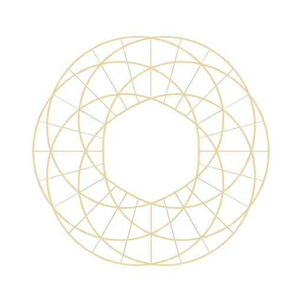

<p align="center">
  <a href="https://geodineum.com">
    
  </a>
</p>

# gNode

The Rust daemon at the centre of a Geodineum Constellation: it owns the RESP3
command-stream wire protocol between PHP services and ValKey, the geometric
topology system, inter-service routing, and the signed-extension pipeline.

Built by **Niels Erik Toren** · Rust daemon, crate `gnode-daemon` (see `daemon/Cargo.toml` for the version)

---

## What it is

gNode is a stateless [tokio](https://tokio.rs) daemon. Services do not call it
directly - they `XADD` commands onto a ValKey stream, and gNode consumes them,
runs the work (native handlers or ValKey Lua functions), and writes the response
back to a polling key. Because every request carries its own routing and identity
fields, one daemon serves many tenants and environments at once.

All state lives in ValKey - topology, service registry, relay policy, telemetry.
The daemon process holds no durable state of its own: restart it and it
rediscovers everything from ValKey. It exposes no HTTP surface; the wire is RESP3
over ValKey (port 47445), and the protocol is the contract.

## Public build surface

What you build against is the **wire protocol**, not the daemon's Rust
internals:

- **Commands** - the canonical command catalogue (names, aliases, parameters,
  returns, execution lane) delivered by `XADD` to a site's unified stream.
- **Lua functions** - the `FCALL` surface that runs inside ValKey.
- **Wire format** - the RESP3 field contract (one canonical alias list, resolved
  identically on every path) and the stream/response-key layout.

The complete catalogue of every command and every Lua function is
**[`COMMAND_SCHEMA.md`](COMMAND_SCHEMA.md)** - the single home for that surface.
It is a curated reference, kept honest by a checker: `php
scripts/check-command-schema.php` diffs it against the compiled command
inventory (`gnode-daemon dump-schema`) and the Lua sources, so a command or
function can never be added or renamed without the doc failing until it matches.

**Internal** - the daemon crate under `daemon/src/` (handlers, dispatch, topology
storage, the extension loader) is implementation. It changes without notice;
nothing outside the daemon should build against Rust symbols.

Most PHP callers never touch the wire at all - they use the reference client,
**gNode-Client**, which turns the protocol into ordinary method calls.

## Capabilities

- **Geometric discovery** - services register a capability vector and are found
  by spatial proximity in Q64.64 fixed-point space, not by name.
- **Multi-tier topology** - the canonical tier schemas (service, tool,
  constellation, galaxy) that place entities in geometric space for discovery.
- **Inter-service routing** - a command tagged with a relay target is resolved,
  policy-checked, optionally format-translated, and forwarded to the target's
  stream, so the sender needs no ACL on the target's keyspace.
- **Two execution lanes** - Fast (async-spawned, unordered, the default) and
  Ordered (synchronous inline) for commands with cross-request ordering
  semantics.
- **Stateless multi-tenancy** - one daemon serves many `(site, environment)`
  pairs; DTAP environments stay isolated across relays.
- **Signed extensions** - additional command and Lua surface loads only from
  Ed25519-signed extension bundles verified against the baked-in author key.
  Advanced topology - a named multi-topology registry, cross-topology queries,
  and dependency graphs - ships this way as the **gNode-TOPO** extension
  (Chapter 2), not in the base daemon.

## Contract

The precise integration surface - wire field aliases, message shapes, stream and
response-key layout, required ValKey capabilities, and the signed-extension
expectation - is in **[`CONTRACT.md`](CONTRACT.md)**. Agents should prime from
**[`CONTRACT.scn.md`](CONTRACT.scn.md)**. The exhaustive command and function
catalogue is **[`COMMAND_SCHEMA.md`](COMMAND_SCHEMA.md)**.

## Quick start

The Geodineum installer builds the binary and provisions ValKey; these commands
talk to a running daemon. `redis-cli` on a Geodineum host is a symlink to
`valkey-cli`.

```sh
# The daemon and its ValKey instance
systemctl status gnode-daemon
systemctl status valkey-gnode

# Round-trip a command end-to-end: register a service, then read the response.
AUTH="$(sudo cat /etc/geodineum/credentials/valkey.password)"

# 1. XADD a command onto the site's unified stream (production environment).
#    The braces are literal - a ValKey cluster hash-tag that keeps a site's
#    keys in one slot. Write {mysite}, not mysite.
REDISCLI_AUTH="$AUTH" redis-cli -p 47445 XADD '{mysite}:gnode:unified:production' '*' \
    id req-001 t c c register_service \
    p '{"id":"svc-1","capabilities":{"compute":0.8,"latency_class":2}}' \
    ss mysite sn node-1 ts 1718000000000

# 2. Poll the response key (10-second TTL - read within a few seconds)
REDISCLI_AUTH="$AUTH" redis-cli -p 47445 GET '{mysite}:res:req-001'
# -> {"id":"req-001","status":"ok","result":{...},"error":null,"timestamp":...}

# 3. Call a Lua function directly
REDISCLI_AUTH="$AUTH" redis-cli -p 47445 FCALL GNODE_GEOMETRIC_GET_DIMENSIONS 0
```

From PHP, the same round-trip is `gNodeClient::forSite('mysite','production')`
followed by ordinary method calls - see `gNode-Client/README.md`. Field shapes,
aliases, and every command's parameters are in
[`COMMAND_SCHEMA.md`](COMMAND_SCHEMA.md).

## Limits worth knowing

- **No HTTP surface - RESP3 only.** Clients reach the daemon through ValKey
  streams; there is no REST endpoint by design.
- **ValKey 7.2+ is required** (port 47445) for `FUNCTION LOAD`, RESP3, and
  consumer groups.
- **Response keys expire after ~10 seconds.** A late poller silently loses the
  response; poll within a few seconds and handle a missing key gracefully.
- **Relay policy defaults to allow (fail-open).** To lock a Constellation down,
  set an explicit deny policy - see [`CONTRACT.md`](CONTRACT.md).
- **Ordered-lane commands block their consumer thread** with no per-command
  timeout; a slow Ordered handler stalls messages behind it. Reserve the Ordered
  lane for commands that truly need it.
- **The extension author key is single and baked in.** Rotating it means
  recompiling the daemon; there is no key versioning.

## Collaborate

Contributions are welcome. Open issues and pick up work on the ecosystem board
at [geodineum.com](https://geodineum.com); issues tagged `good-first-issue` are
a good place to start.

- Fork, branch, and open a pull request against `main`.
- Any change to a wire contract must update **both** `CONTRACT.md` and
  `CONTRACT.scn.md` in the same commit.
- A change to a signed extension must be re-signed in the same commit.

## Author & support

Built by **Niels Erik Toren**.

If you want to support the work:

| Currency | Address |
|---|---|
| Bitcoin (BTC) | `bc1qwf78fjgapt2gcts4mwf3gnfkclvqgtlg4gpu4d` |
| Ethereum (ETH) | `0xf38b517Dd2005d93E0BDc1e9807665074c5eC731` / `nierto.eth` |
| Monero (XMR) | `8BPaSoq1pEJH4LgbGNQ92kFJA3oi2frE4igHvdP9Lz2giwhFo2VnNvGT8XABYasjtoVY2Qb3LVHv6CP3qwcJ8UnyRtjWRZ5` |

## Disclaimer

This software is provided **"as is"**, without warranty of any kind, express or
implied. Use of this software is entirely at your own risk. In no event shall the
author or contributors be held liable for any damages arising from the use or
inability to use this software.

## License

Licensed under either of

* [Apache License, Version 2.0](LICENSE-APACHE)
* [MIT License](LICENSE-MIT)

at your option.
